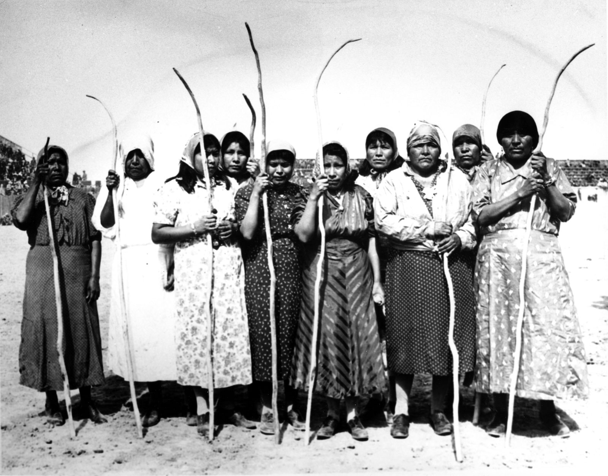

# Pima-indians
Hello world, what's up? Today I am coming with another repository about deep learning. This repository aims to help you understand how to build a basic deep learning model by performing a simple classification task on the pima indians dataset. 

## INTRODUCTION
The Pima indians are a group of Native Americans well known for the high rate of obesity and diabetes present in the community. For this particular reason, many researchers study that group in order to understand which factors play a major role in causing the diseases. In this  post, we'll try to diagnostically predict whether or not a patient has diabetes, based on certain diagnostic measurements. To achieve our goal, we'll use the Pima Indians Diabetes Database provided by UCI. Basically, we are trying to resolve a binary classification here [The patient has diabetes--> output=1, The patient has not diabetes-->output=0] using several information about the patient such as [Pregnancies, GlucosePlasma, BloodPressure,SkinThickness,Insulin2-Hour serum insulin (mu U/ml), BMIBody mass index, DiabetesPedigreeFunction, Age] as inputs for our model.

Here's a picture of some pima people.

     

Source: https://www.britannica.com/topic/Pima-people 

## THE DATASET
You can find the data set at the following adress https://www.kaggle.com/uciml/pima-indians-diabetes-database. All the explanations you need are there too so don't worry :). We split the data set in 2 sets : a training set (90%) and the test set(10%).

## THE PROJECT
Everything is inside the kera_first_network.ipynb. You'll see how I load the data, how I build, train and test the deep learning model.

## RESULTS
I trained the model on 300 epochs and obtained an accuracy of 0.76 on the test set.

     

As we can see on the next image, the deep learning model does not predict the right output for some inputs.

     

## IMPROVEMENT IDEAS
Our model is not perfect but the performances are not that bad. To improve the performances, it could be interesting to add some layers to the current model, use some optimization techniques (normalization, drop out, regularization) or add more examples to the current dataset (if possible).
If you try one of these and have better results, let me know. Good luck and thank you for your attention :).
